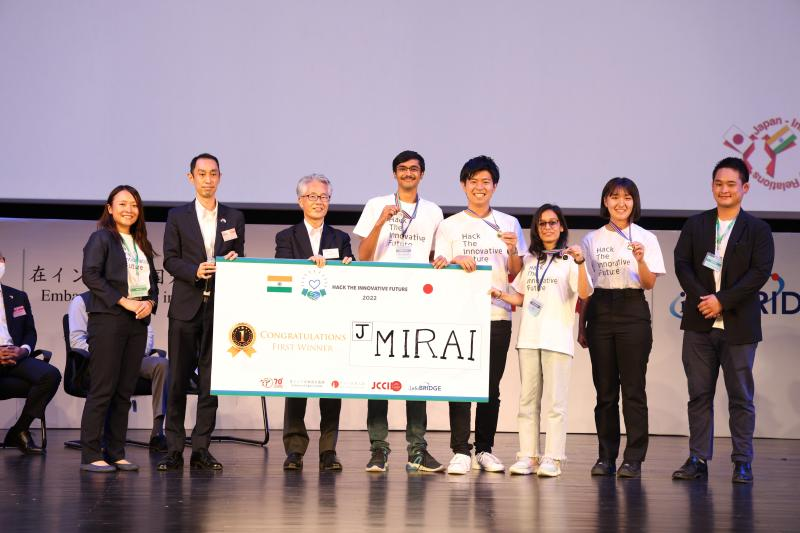
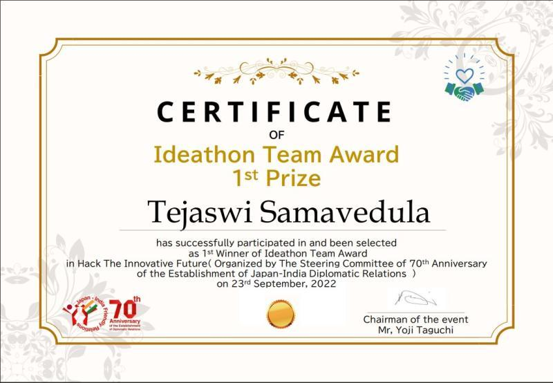
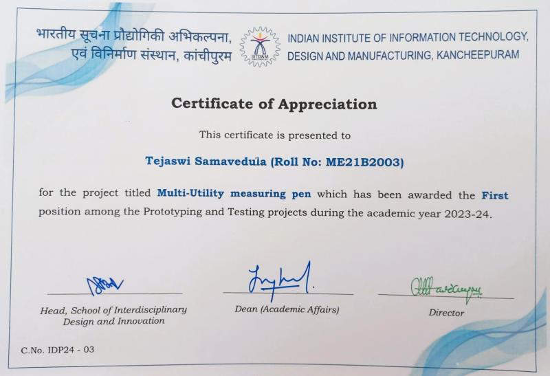

# Awards and Achivements

## Hack the Innovative Future
Selected from 5,000 applicants across India to join a team for an Ideathon organized by the Embassy of Japan, celebrating 70 years of India-Japan relations. My team "Mirai" worked on a problem statement "Reducing unemployment rate in India through adjusting supply and demand in both countries". We secured first place and were awarded by the Ambassador of Japan to India.

{ width="400" loading=lazy } { width="400" loading=lazy }

## Best Project for Prototyping and Testing
Awarded by the Director for the Prototype "Multi Utility Measuring (MUM) Pen".

{ width="400" loading=lazy }