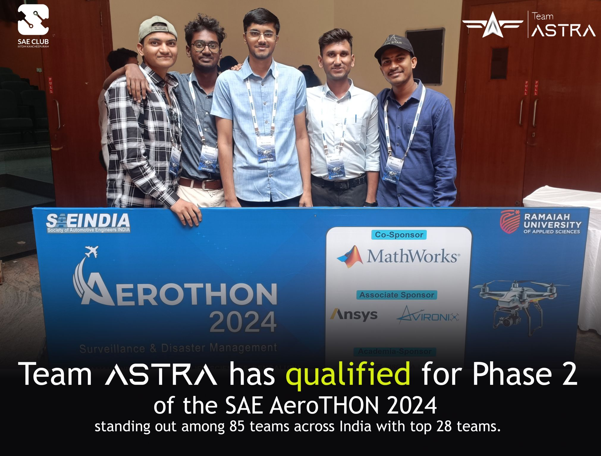
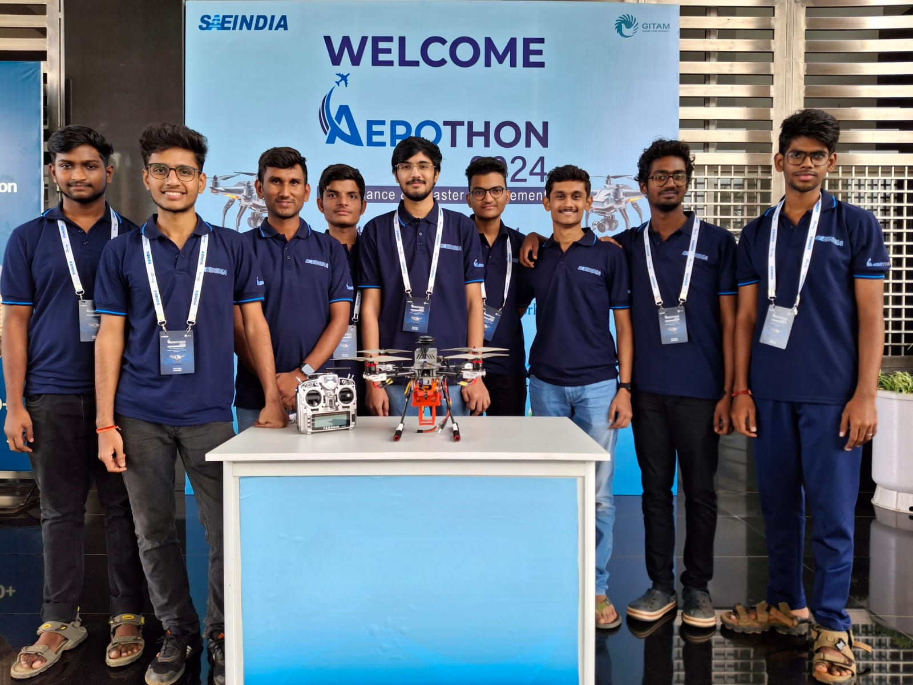
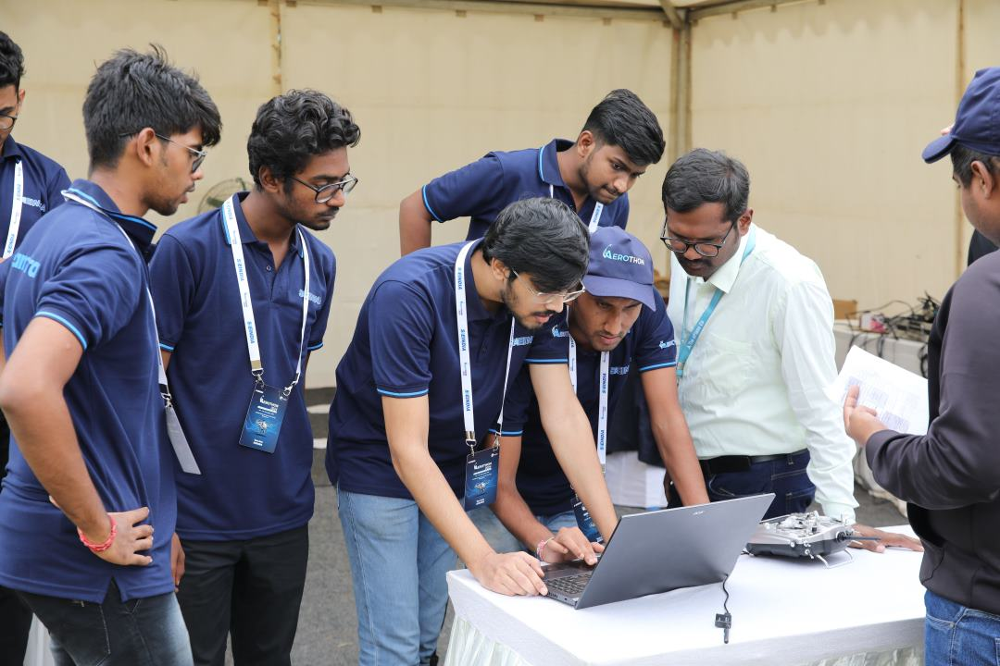
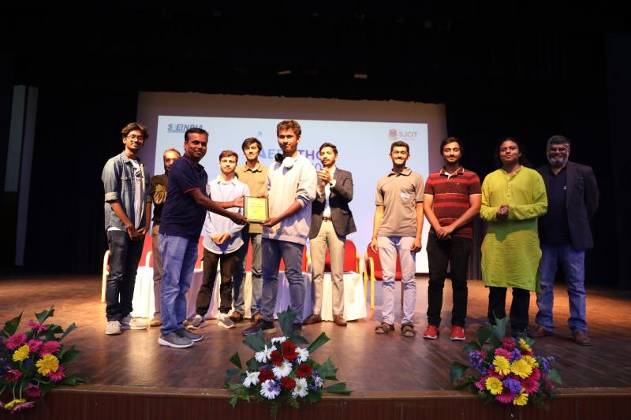
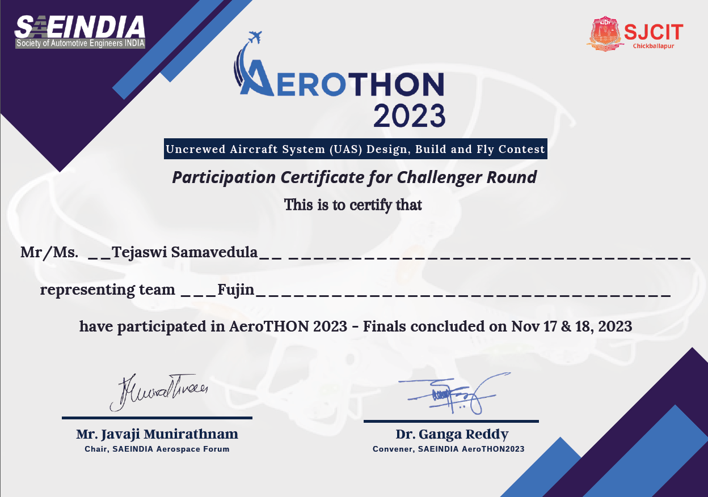
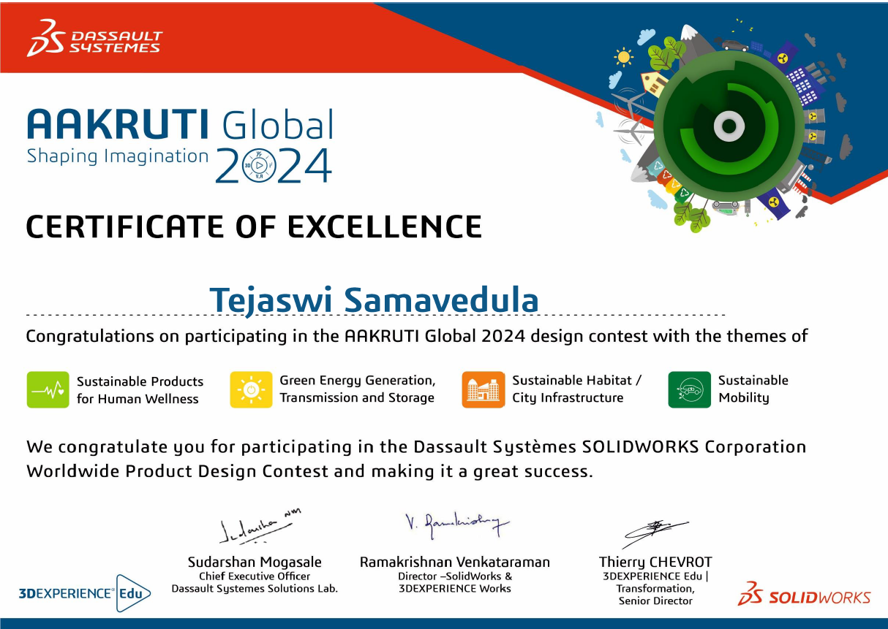

# Awards and Achivements

## Awards
### Hack the Innovative Future
Selected from 5,000 applicants across India to join a team for an Ideathon organized by the Embassy of Japan, celebrating 70 years of India-Japan relations. My team "Mirai" worked on a problem statement "Reducing unemployment rate in India through adjusting supply and demand in both countries". We secured first place and were awarded by the Ambassador of Japan to India.

{ width="400" loading=lazy } { width="400" loading=lazy }

### Best Project for Prototyping and Testing
Awarded by the Director for the Prototype "Multi Utility Measuring (MUM) Pen".

{ width="400" loading=lazy }

## Achivements
### SAE AeroTHON 2024
Lead a 15-membered team for participated in SAE AeroTHON 2024. Presented the design to jury in Bangalore (June 2024) for Phase 1. Qualified for Phase 2 with other 28 teams out of 85 teams across India. Designed and Manufactured the quadcopter for Phase 2 of the competition. Completed autonomous and manual missions.

{ width="400" loading=lazy } { width="400" loading=lazy } { width="400" loading=lazy } { width="270" loading=lazy }

### SAE AeroTHON 2023
Part of a 10-membered team, designed and fabricated the drone body. I used Fusion 360 for designing, Ultimaker Cura for slicing the STL model file for 3D printing. Team achived first place in SAE AeroTHON 2023 Challenger Round.

{ width="400" loading=lazy } { width="390" loading=lazy }

### AAKRUTI Global by Dassault Systèmes
Participated in AAKRUTI 2024 design contest with the theme of Sustainable Mobility. Worked with a team to design a Rope-Way AirTaxi system for urban areas.

{ width="400" loading=lazy }