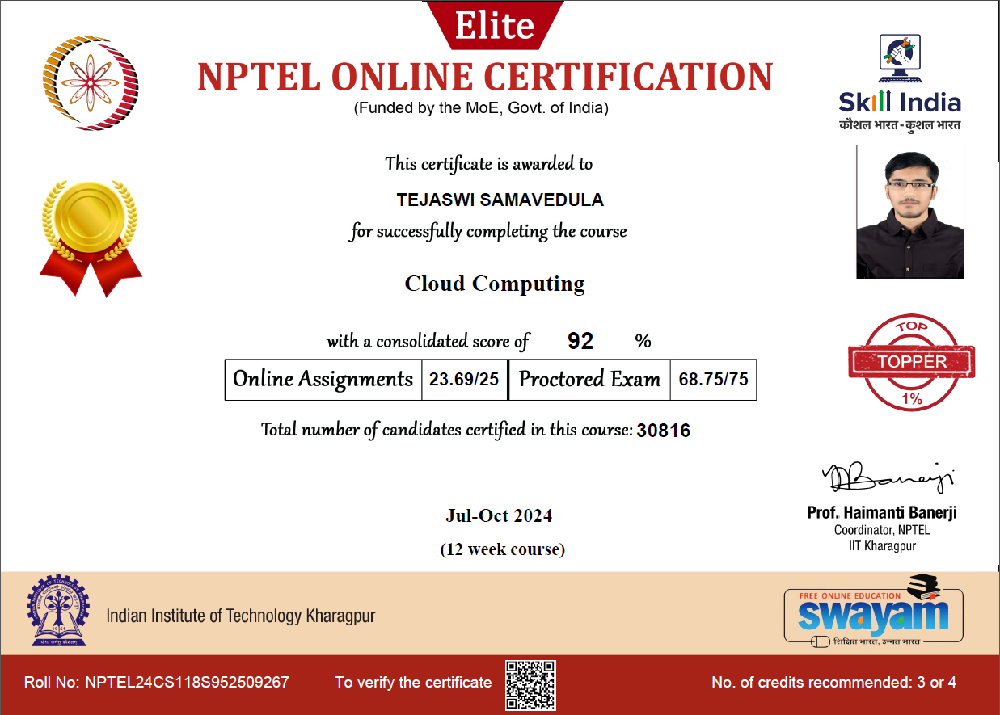

# Courses and Certifications

## Certifications

### 1. SOLIDWORKS CAD Design Associate (CSWA) [:material-link:](https://cv.virtualtester.com/qr/?b=SLDWRKS&i=C-NHRPXV5GZQ){:target="_blank"}
*Issued by: Dassault Systèmes, October 2024*

{ width="600" }

## Courses

### 1. Self Driving and ROS 2 - Learn by Doing! Odometry & Control [:material-link:](https://www.udemy.com/certificate/UC-831a960c-8c63-47ff-b20d-5479af50f8a1/){:target="_blank"}
*Issued by: Udemy, July 2024*

{ width="600" }

### 2. ROS2 Nav2 [Navigation 2 Stack] - with SLAM and Navigation [:material-link:](https://www.udemy.com/certificate/UC-6913cda0-d675-4cf4-8fce-5b11dcb3a330/){:target="_blank"}
*Issued by: Udemy, July 2024*

{ width="600" }

### 3. Supervised Machine Learning: Regression and Classification [:material-link:](https://www.coursera.org/account/accomplishments/verify/TAVURYZTJJXK){:target="_blank"}
*Issued by: DeepLearning.AI, June 2023*

{ width="600" }

### 4. Cloud Computing [:material-link:](https://nptel.ac.in/noc/E_Certificate/NPTEL24CS118S95250926704136391){:target="_blank"}
*Issued by: NPTEL, Nov 2024*

{ width="600" }