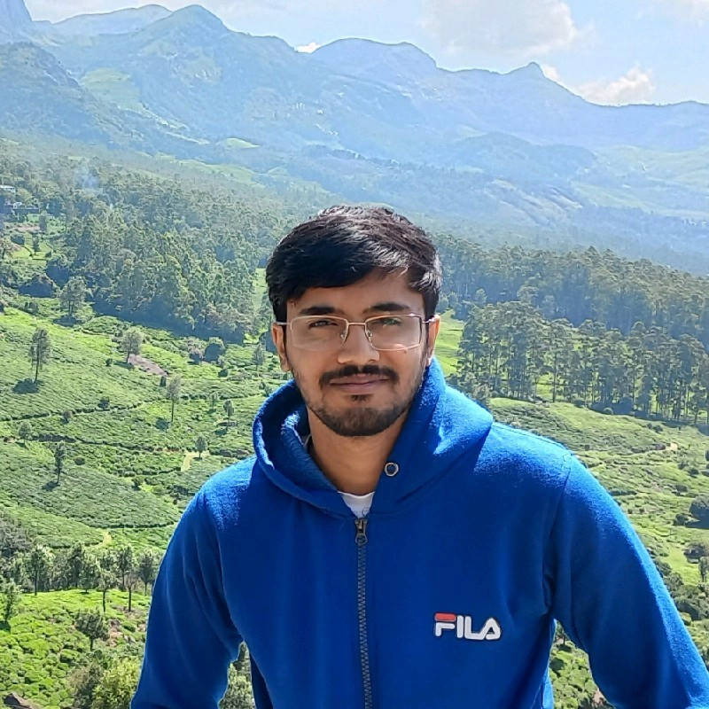

{ align=right width="300" loading=lazy class="circular-image"}

# **About Me**
 [:fontawesome-brands-linkedin-in:](https://www.linkedin.com/in/tejaswisamavedula/){:target="_blank"} 
[:simple-github:](https://github.com/tejaswisam){:target="_blank"} [:simple-maildotru:](mailto:tejaswisamavedula@gmail.com){:target="_blank"}

 
Hi, I’m Tejaswi Samavedula — a final-year B.Tech student in Smart Manufacturing at IIITDM Kancheepuram with a passion for building intelligent hardware systems that seamlessly blend design, sensors, and embedded systems.

I specialize in end-to-end product prototyping, combining skills in CAD design, embedded development (ESP32, STM32, ROS2), and sensor integration to bring real-world ideas to life. I’m deeply drawn to hardware design, and I enjoy exploring cross-disciplinary projects — from electronics to mechanical systems — always with a hands-on, detail-oriented approach.

I focus on creating solutions that are both functional and user-centered. I'm driven by innovation, curiosity, and always on the lookout for opportunities to design smarter, better-engineered tools.

- [:material-microscope: &nbsp; My Research](research/index.md)
- [:material-file-cad-box: &nbsp; Projects](projects/index.md)
- [:material-certificate: &nbsp; Certifications](certifications/index.md)
- [:fontawesome-solid-award: &nbsp; Awards](awards/index.md)

## Contact

For job opportunities, or collaborations, feel free to reach out at: [`tejaswisamavedula@gmail.com`](mailto:tejaswisamavedula@gmail.com){:target="_blank"}

[:simple-googledocs: Resume](resume/Tejaswi_Samavedula_Resume.pdf){:target="_blank" .md-button}

## Education
!!! note ""
    { align=left width="110" loading=lazy }
    { align=left width="110" loading=lazy }
    **Indian Institute of Information Technology (IIIT), Design and Manufacturing, Kancheepuram** [:material-web:](https://www.iiitdm.ac.in/){:target="_blank"}
     
    *Chennai, Tamil Nadu, India*
     
    Bachelor of Technology, Smart Manufacturing
     
    *December 2021 – July 2025*
     
    *Relevant coursework*: Robotics and Automation, Analysis and Synthesis of Robot Mechanisms, Linear Algebra, Machine-to-Machine Communication, Sensors and Control, Embedded Systems, Prototyping and Testing, Production Drawing Practice, Operations Research

## Skills
The skills that I learnt and explored in various [Projects](projects/index.md).

- Languages/Frameworks:&nbsp; :simple-ros: ROS2 &nbsp; :simple-python: &nbsp; :simple-cplusplus:

- Developer Tools:  &nbsp; :simple-git: &nbsp; :simple-github: &nbsp; :simple-gnubash: &nbsp; :simple-linux: &nbsp; :simple-docker:
- Softwares:  :simple-dassaultsystemes: SolidWorks &nbsp; :simple-autocad: Fusion 360 &nbsp; :simple-altiumdesigner: Altium 
- Hardware: :simple-arduino: Arduino &nbsp; :simple-nvidia: Jetson &nbsp; :simple-raspberrypi: Rpi &nbsp; :simple-stmicroelectronics: STM32 

## Certifications
{ width="100" }

Check [Certifications](certifications/index.md) page for other relevent certificates.

## Languages

- :flag_gb: &nbsp; English (Business)
- :flag_in: &nbsp; Hindi (Native)
- :flag_in: &nbsp; Telugu (Native)
- :flag_jp: &nbsp; Japanese (Beginner)

## Experience
!!! note ""
    **Mechatronics Engineer Intern**
     
    Techolution India [:material-web:](https://www.techolution.com/){:target="_blank"}
      
    Hyderabad, Telengana, India
     
    Jan 2025 – June 2025, Internship
     

    - Designed mechanical components and mechanisms for a Robotics AI Hand, ensuring functionality, manufacturability, and seamless integration with electronics.

    - Converted detailed CAD assemblies into URDF (Unified Robot Description Format) for simulation and control in ROS environments.

    - Collaborated with the electronics team on PCB layout planning, sensor positioning, and wiring optimization.

    - Contributed to firmware development, assisting in motor control programming and integration of sensor data streams.

    - Reviewed and analyzed multiple IC and component datasheets to support hardware understanding and proper firmware implementation.

!!! note ""
    **Research Intern**
     
    Autonomous Robotics (ARISE) Lab, IIITDM Kancheepuram [:material-web:](research/index.md)
      
    Chennai, Tamil Nadu, India
     
    May 2024 – Dec 2024, Internship
     

    - Conducted research on indoor mapping and navigation using nano-drones, focusing on efficient and low-cost autonomous exploration.

    - Developed and tested algorithms for sensor fusion and navigation in GPS-denied environments using ROS2 and tested in gazebo simulation and verifed through hardware implementation.

    - Demonstrated the research at COMSNETS 2025 Demos and Exhibits, an international conference on communication systems and networks.

    - Proceedings were published in IEEE Xplore, detailing the methodology and outcomes.
     
    [See Research](research/index.md)&nbsp;|&nbsp;[View Publication](https://ieeexplore.ieee.org/abstract/document/10885580){:target="_blank"}

!!! note ""
    **Team Captain**
     
    Astra IIITDM - Aerial Robotics Team [:material-web:](https://www.linkedin.com/company/astra-iiitdm/){:target="_blank"}
      
    Chennai, Tamil Nadu, India
      
    Jan 2024 – Dec 2024, Part-time
     

    - Led a 24-member interdisciplinary team focused on developing advanced technologies in aerial robotics, with participation in national and international autonomous drone competitions.

    - Contributed to the development of an autonomous navigation stack for a quadcopter drone using ROS2 and PX4 flight stack, including path planning and sensor data processing.

    - Worked extensively with Jetson Orin Nano and Raspberry Pi for onboard processing, and interfaced with the PX4 Autopilot flight controller for flight control and telemetry.

    - Integrated FrSky radio telemetry modules for real-time manual override, system monitoring, and flight data feedback.
