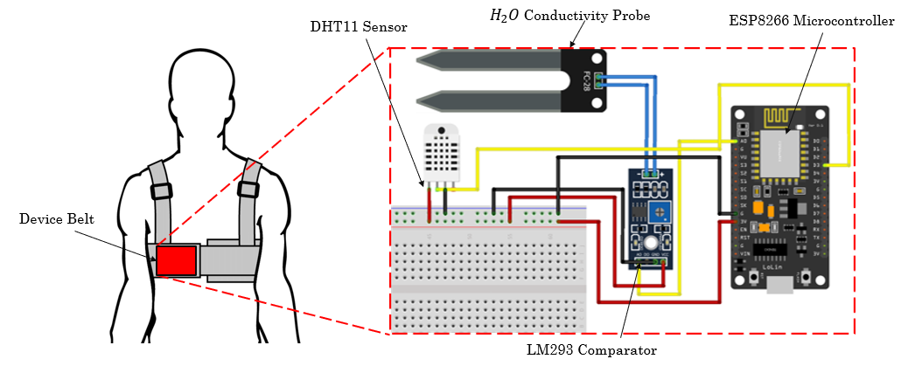
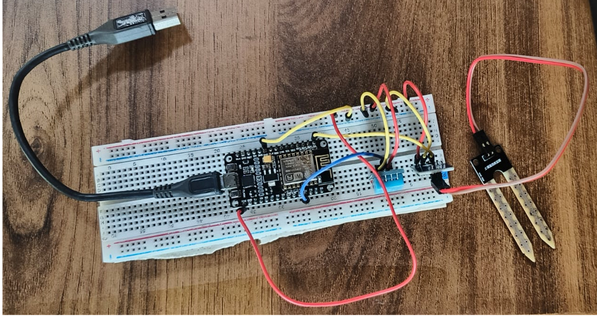
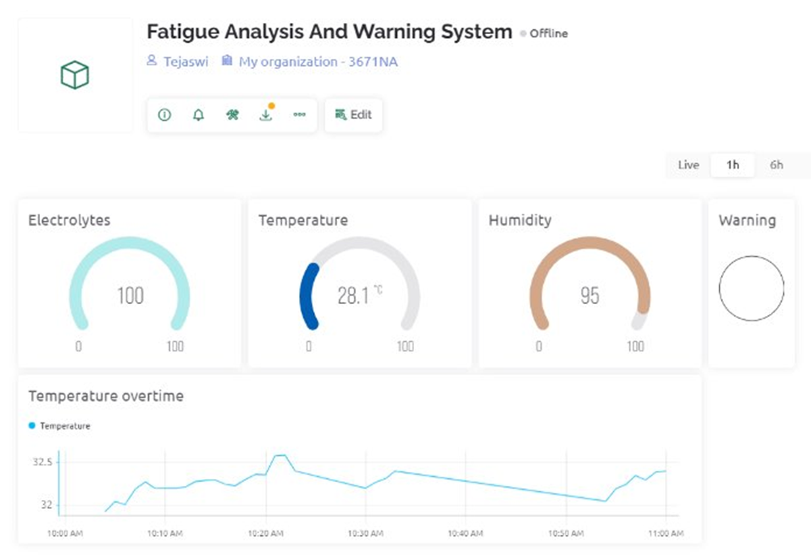
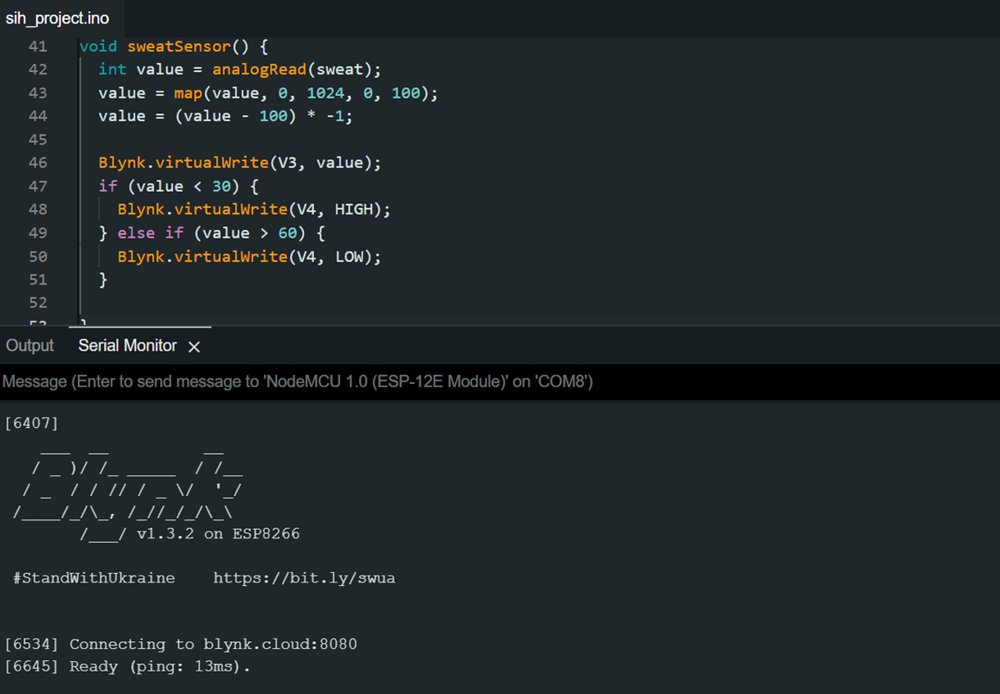

---
tags:
  - ESP32
  - IOT
  - Electronics
  - Sensors
---
# Sweat based athlete exhaustion detection device
> :octicons-location-16: Developed at IIITDM Kancheepuram &nbsp;
> :material-calendar: Mar 2024 - Apr 2024 &nbsp;
> :simple-github: [Github Repository](https://github.com/tejaswisam/crazyswarm2){:target="_blank"}

## Introduction
In this project I developed a wearable device that integrates sensors for monitoring physiological parameters, including sweat electrolyte levels, temperature, and humidity, during exercise sessions. The collected data will be used to train a machine learning model capable of predicting critical electrolyte levels. The system will transfer the sensor data to a cloud server, where the incoming data and provide personalized warnings to the athlete if the predicted electrolyte levels fall below a predetermined threshold, indicating potential fatigue or dehydration.

{ width="500" loading=lazy } { width="400" loading=lazy }

## Integration with cloud
In this IoT architecture involving a sweat sensor (moisture sensor), temperature and humidity sensor connected to a NodeMCU ESP8266 microcontroller board that collects and processes sensor data, which is then transmitted to a cloud server (BlynkIOT) for further signal processing and analysis. The processed data can be accessed and visualized through a mobile device or desktop interface, enabling remote monitoring, data visualization and integration with other systems.

{ width="500" loading=lazy } { width="400" loading=lazy }