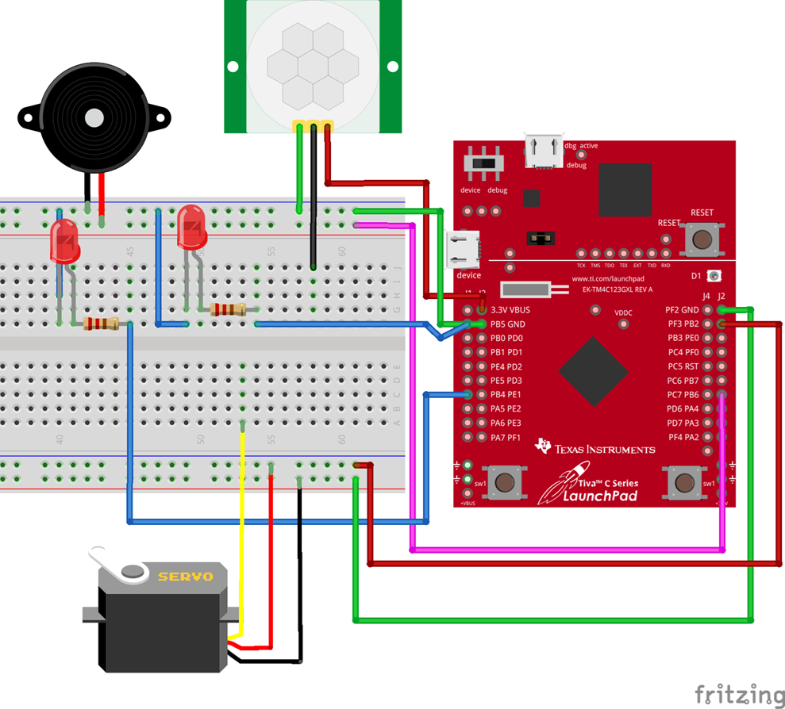
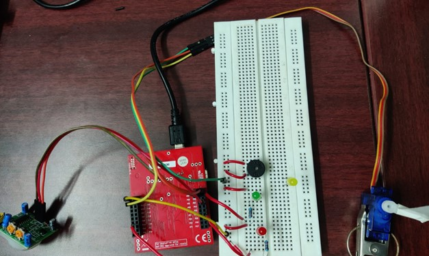
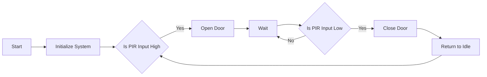

---
tags:
  - Embedded C
  - TM4C123
  - Microcontroller
  - Electronics
  - Sensors
---
# Automatic Door System for Visually Impaired
> :octicons-location-16: Developed at IIITDM Kancheepuram &nbsp;
> :material-calendar: Mar 2023 - Apr 2023 &nbsp;
> :simple-github: [Github Repository](https://github.com/tejaswisam/crazyswarm2)

## Introduction
The Automatic Door Opening System with Tiva board is a project that involves the design and implementation of a system that can detect the presence of a person in front of a door and automatically open the door for them. The project aims to improve accessibility and convenience for people with disabilities, elderly individuals, and others who may benefit from an automatic door opening system.

{ width="400" loading=lazy } &nbsp;&nbsp;{ width="400" loading=lazy }

## Working
- Waits for PIR sensor input to detect a person.
- Opens the door in a staged manner using GPIO signals.
- Operates a servo motor via PWM-like signals for finer control.
- Waits for no motion and then closes the door in reverse sequence.
- Loops back to monitor for the next PIR trigger.

