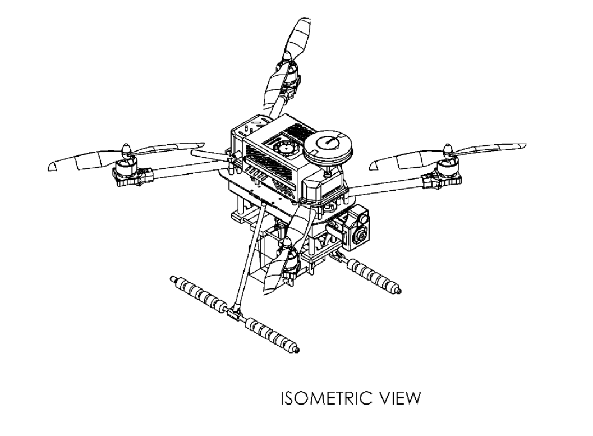
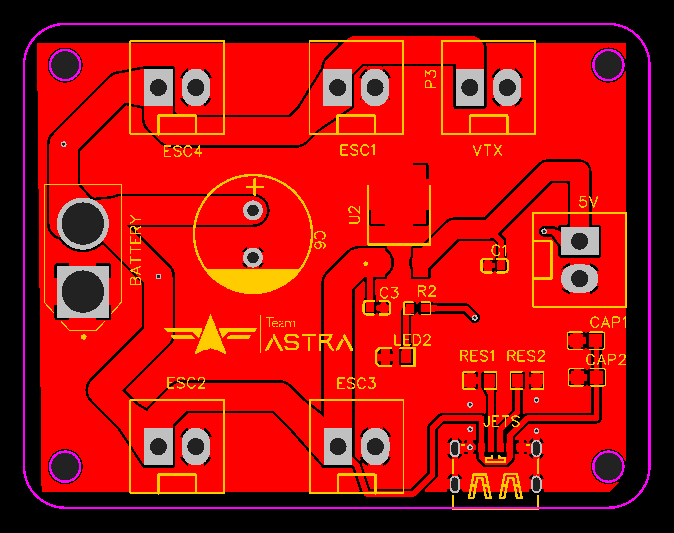
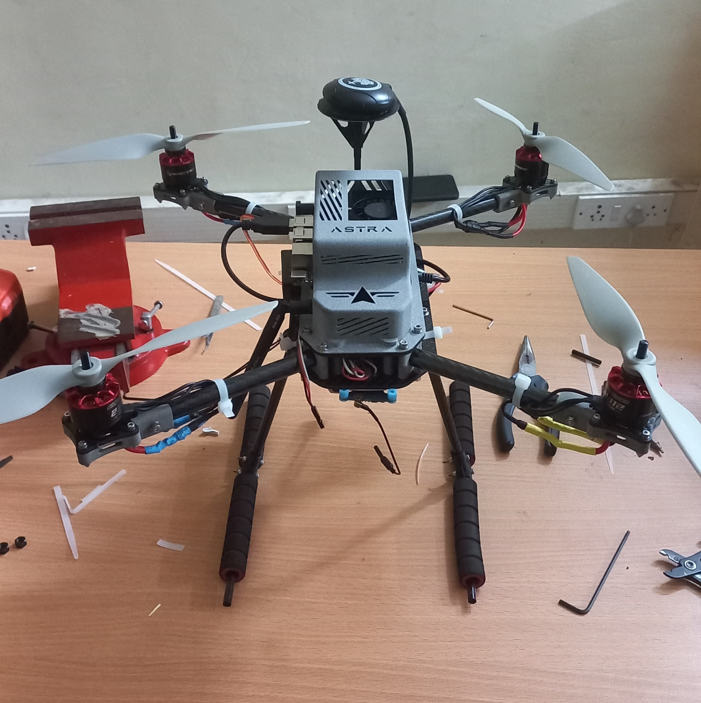
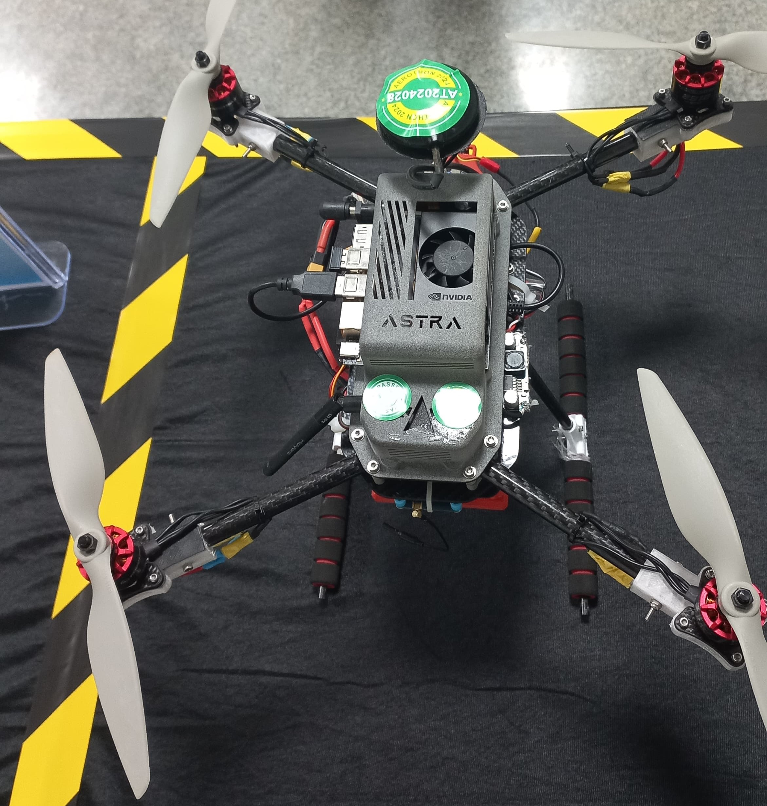
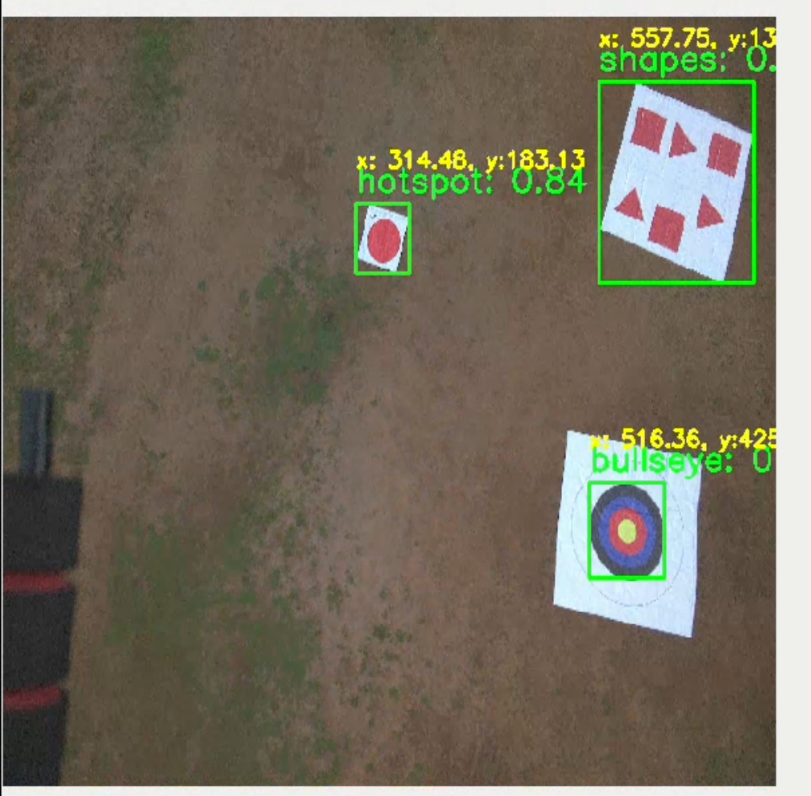

---
tags:
  - ROS2
  - PX4
  - Gazebo
  - SolidWorks
  - PCB Design
  - Python
  - Electronics
  - Soldering
---

# Design and Development of Autonomous Drone
> :octicons-location-16: Developed at Team Astra, IIITDM Kancheepuram &nbsp;
> :material-calendar: Apr 2024 - Nov 2024 &nbsp;
> :simple-github: [Github Repository](https://github.com/Team-ASTRA-Software){:target="_blank"}

## Introduction
This is one the projects that showcase my work on end-to-end product development. As Captain of [Team Astra](https://www.linkedin.com/company/astra-iiitdm/){:target="_blank"}, I oversaw the design, development and testing of an autonomous quadcopter for participation in SAE AeroTHON 2024 competition. Below are some of the contributions that I made for this project.

{ width="400" loading=lazy } { width="300" loading=lazy }

## Designing of Components
I designed the top enclosure and motor holders for this drone in SolidWorks. Followed iterative design process, from figuring out the design requriements to final manufacturing and assembly. Considered the clearances and tolerances before manfufaturing. This was printed by MJF 3D printing method.
<iframe src='https://my.spline.design/untitled-e1c23729b786edb7d8fb10b66147e35b/' frameborder='1' width="500" height="300"></iframe>

## Gazebo Simulation
For ensuring that drone will fly as programmed to complete competition's autonomous mission, I created a simulation envionment in Gazebo with same senario as the main competition. It included our drone and competition arena. This drone was controlled with PX4 mavlink plugin.

{ width="400" loading=lazy }

## Designing of PCB
As the drone was custom built, custom PCB for power distribution was required. I designed a 2-layered PCB that takes power from 3S Lithium-polymer battery and distribute it to 4 ESC and other electronic components. Voltage regulator was added for low-powered components.

{ width="300" loading=lazy }

## Soldering and Assembly of Electronics
Soldered ESCs and other components to power distribution board, assembled and integrated with other electronics (motors, flight controller, etc.) and the drone structure. Connected all actuators to RC reciver at configured channels.

## Final assembly and Testing
After procurement of all electronics and fabrication of drone body, it was assembled and ready for flight testing. We tested it under competition senarios, ensuring no deviation from projected flight.

{ width="300" loading=lazy } { width="300" loading=lazy } { width="300" loading=lazy }
