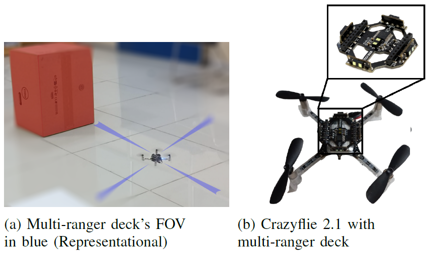
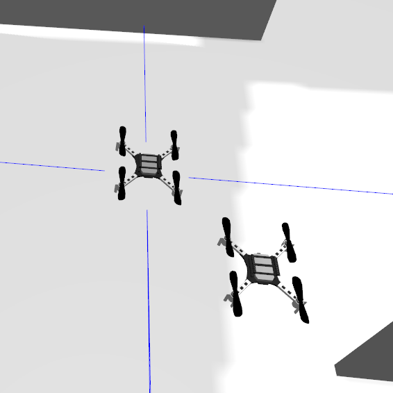
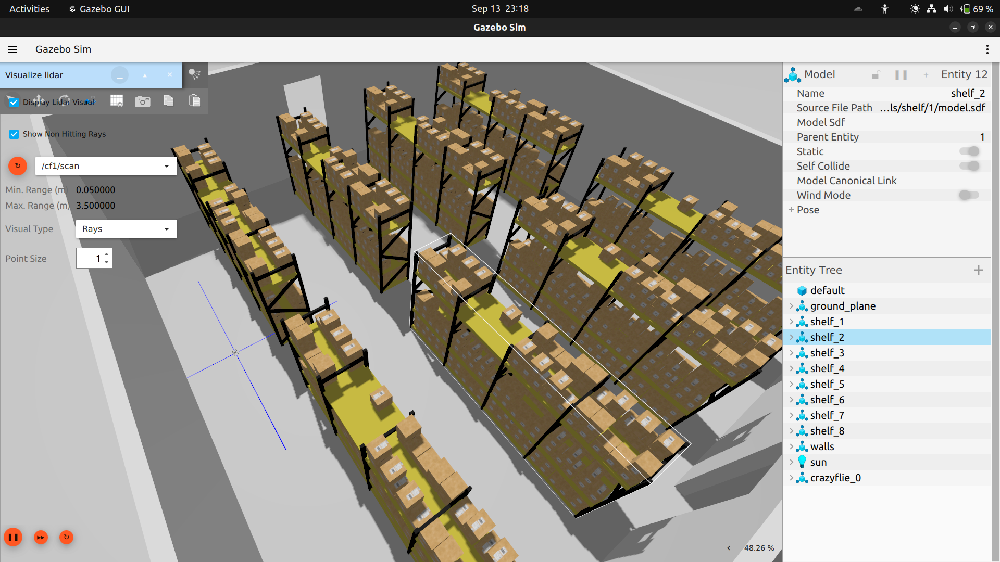

---
tags:
  - ROS2
  - Gazebo
  - Rviz
  - Python
  - Drones
---
# Indoor Mapping and Navigation using Crazyflie Nano-drone
> :octicons-location-16: Developed at ARISE Lab, IIITDM Kancheepuram &nbsp;
> :material-calendar: May 2024 - Nov 2024 &nbsp;
> :simple-github: [Github Repository](https://github.com/tejaswisam/crazyswarm2){:target="_blank"}

## Introduction
{ width="450" loading=lazy } &nbsp; { width="250" loading=lazy }

This project was part of [research](../../research/index.md#publications) which focuses on mapping using nano drones equipped with basic
distance sensors that efficiently map indoor spaces. This system consists of a mapper drone that maps the environment and generates viable paths, which other robots or drones can follow to explore the space efficiently. The algorithm and navigation setup were first tested in a simulation environment using Gazebo Sim where the follower drone traversed the mapper drone’s path with 93.05% accuracy.

## Working
The software framework uses ROS2 middleware with Crazyswarm2 package. The mapper drone’s system handles exploration and trajectory generation, broadcasting viable paths to the follower robots/drones.

{ width="450" loading=lazy }

## Demo
Check out the demo video below:
<iframe width="560" height="315" src="https://www.youtube.com/embed/BqCE9QlfSPI?si=scM5P7XoC-Fqrd9S" title="YouTube video player" frameborder="0" allow="accelerometer; autoplay; clipboard-write; encrypted-media; gyroscope; picture-in-picture; web-share" referrerpolicy="strict-origin-when-cross-origin" allowfullscreen></iframe>