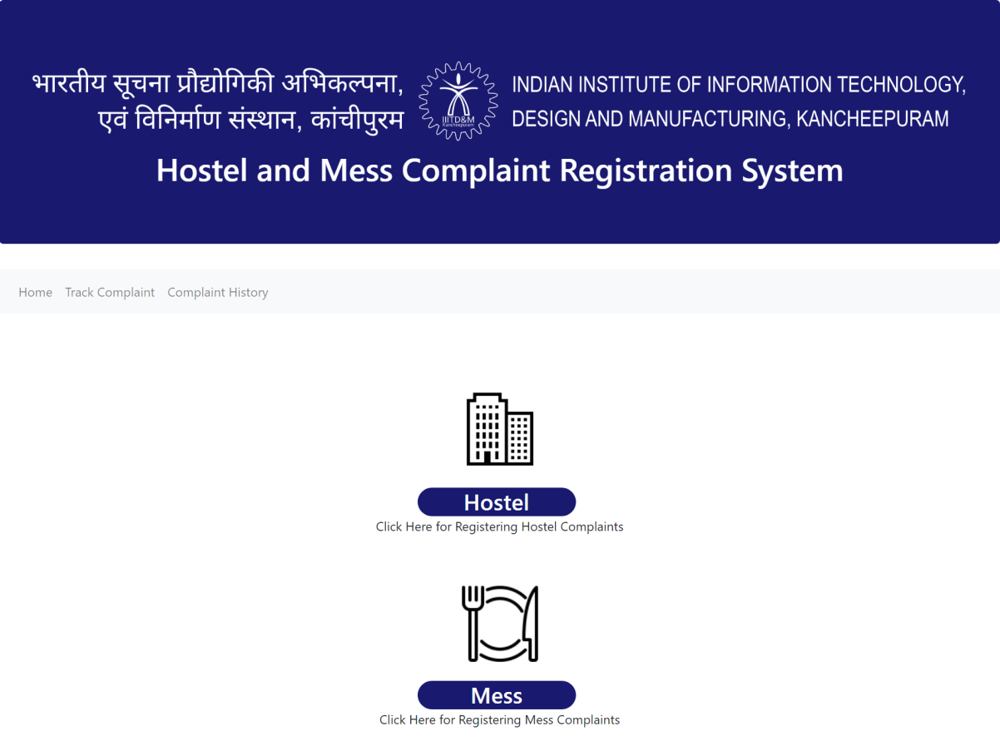
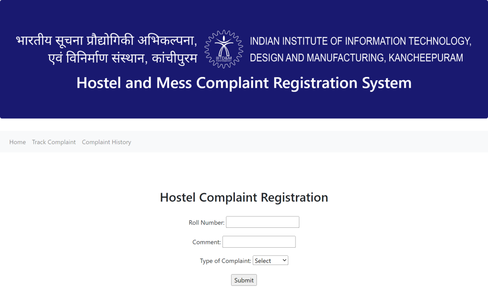
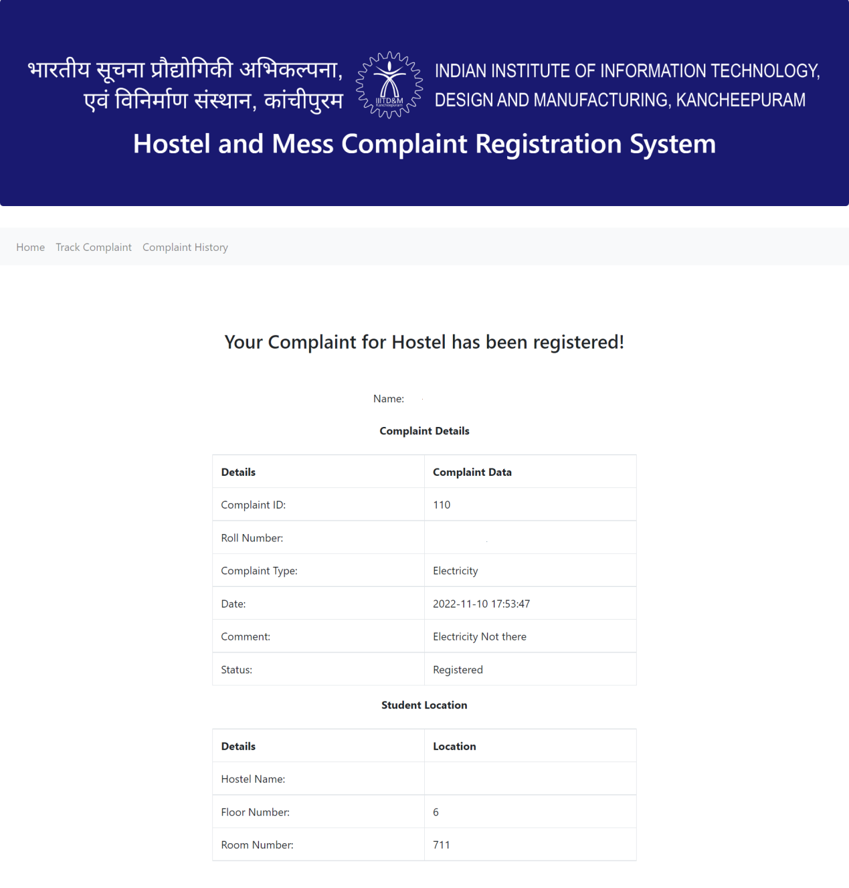
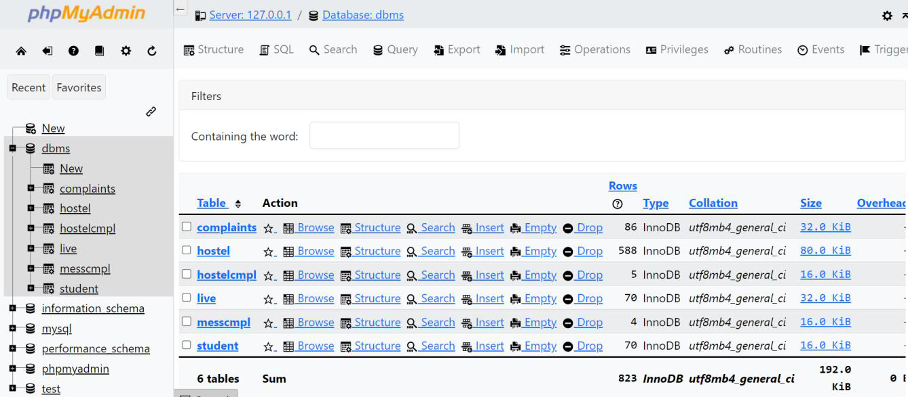
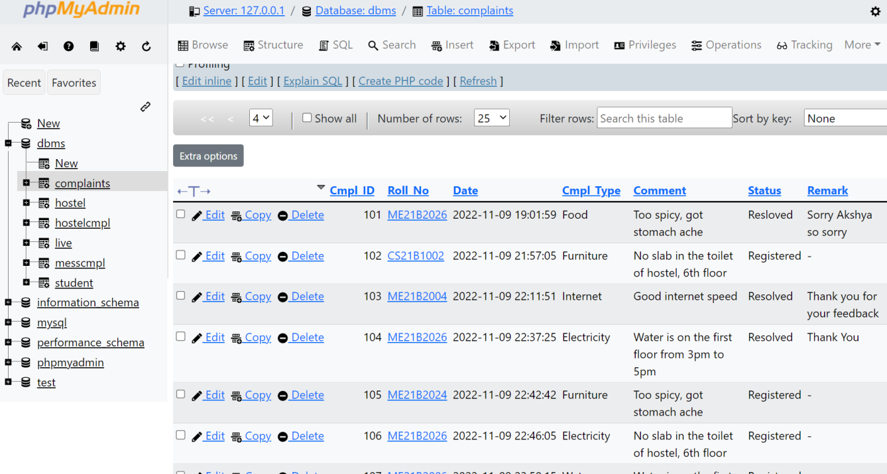

---
tags:
  - MySQL
  - HTML/CSS
  - PHP
---
# Hostel and Mess Complaint Registration System
> :octicons-location-16: Developed at IIITDM Kancheepuram &nbsp;
> :material-calendar: Nov 2022 &nbsp;
> :simple-github: [Github Repository](https://github.com/tejaswisam/complaint_mgmt_sys){:target="_blank"}

## Introduction
Developed a Hostel & Mess Complaint Registration System application which automates the process of complaint registration for both hostel and mess for the student in IIITDM. It also has a complaint tracker and complaint history of a particular student which is based on the both hostel and mess complaint systems. Used MySQL as query language with PHP for backend and HTML/CSS for frontend.

## User Interface

-   Main Page

    ---

    { width="400" loading=lazy }

-   Complaint Registration Page

    ---

    { width="400" loading=lazy }

-   Complaint Confirmation Page

    ---

    

-   phpMyAdmin Page (Database: dbms)
    
    ---

    
    

