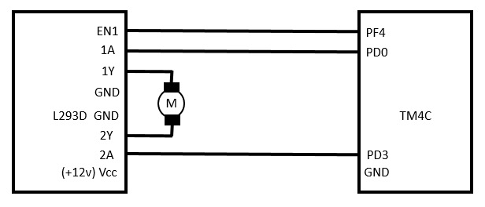
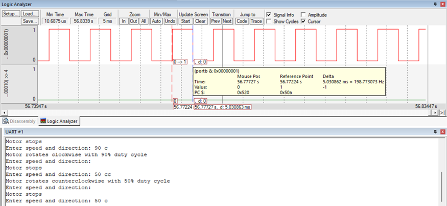
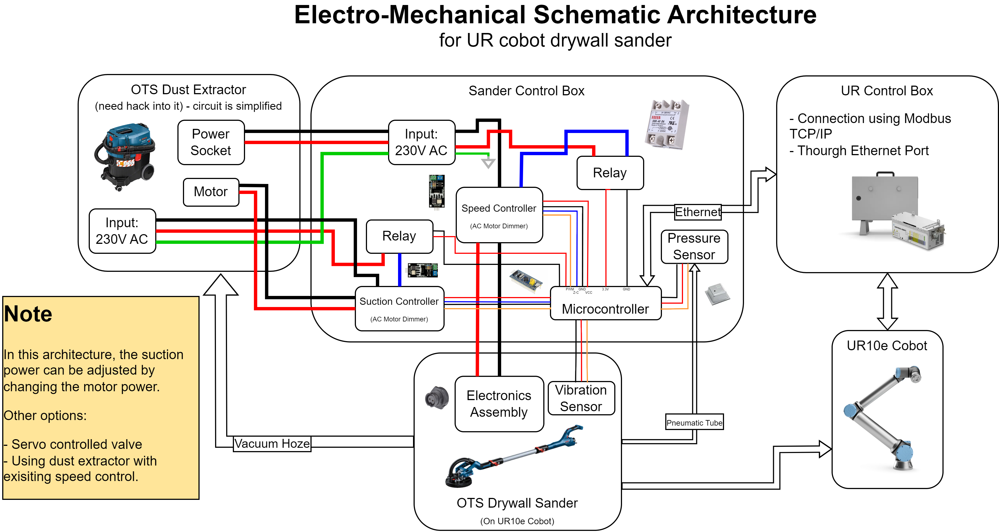

# Miscellaneous Projects
Some mini projects (under construction)

## Altium Designer Projects

## Control of DC Motor using UART

> :simple-github: [Github Repo](https://github.com/tejaswisam/embedded_projects/blob/main/uart_motor_control.c)

{ width="300" loading=lazy } { width="500" loading=lazy }

## UR Cobot Drywall Sander
{ width="500" loading=lazy }

