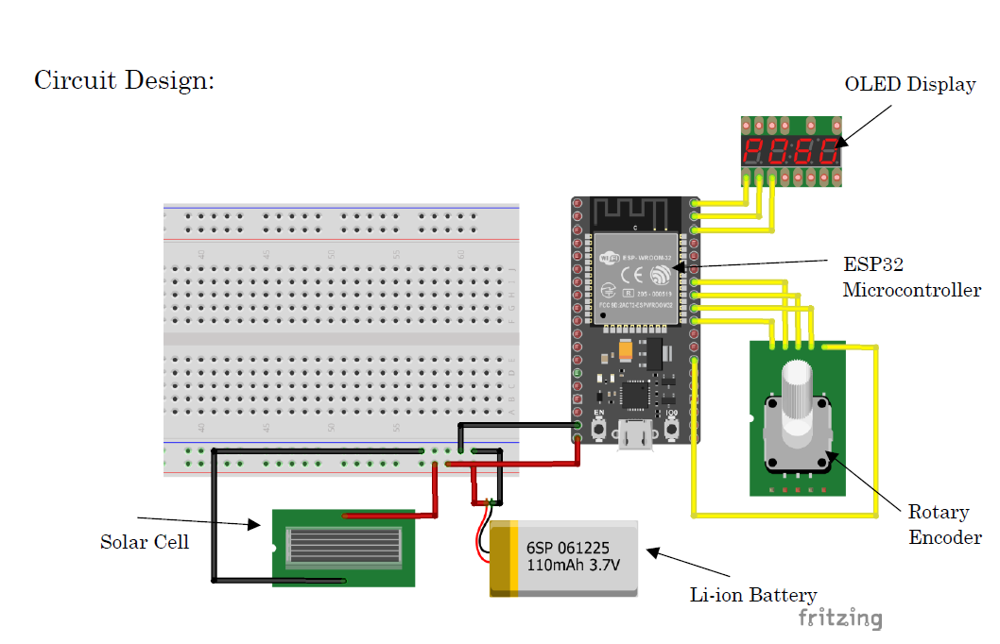

---
tags:
  - ESP32
  - 3D Printing
  - Fusion 360
  - CAD Modeling
  - Electronics
  - Soldering
  - Sensors
  - IOT
---
# Multi-Utility Measuring Pen (Patent Pending)
> :octicons-location-16: Developed at IIITDM Kancheepuram &nbsp;
> :material-calendar: Feb 2024 - Apr 2024 &nbsp;

## Introduction
I designed and developed Multi-Utility Measuring Pen (MUM-Pen), a device that combines a writing tool and a measuring instrument in one. The MUM-Pen has two sides: writing side and measuring side. The writing side can be used to take notes, markings, sketches, or diagrams. The measuring side uses an encoder to measure the distance between two points and a digital display to display it.

{ width="500" loading=lazy } { width="400" loading=lazy }

## Circuit Design

{ width="500" loading=lazy }

## Working
It uses an encoder for determining distance between two points. It sends signal to ESP-32 microcontroller, that maps the encoder output signal and convert it to distance travelled. Microcontroller will get power from rechargeable Lithium-ion battery, which will be charged by a solar panel.

{ width="400" loading=lazy } { width="200" loading=lazy }

## Output
Output can be seen on any device connected to same network and area calculation can be performed.

{ width="400" loading=lazy }