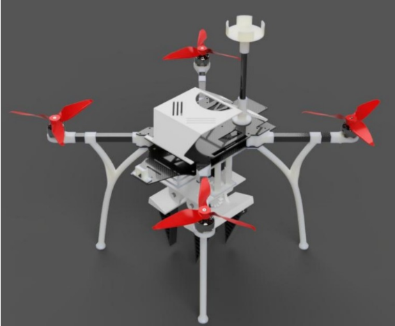
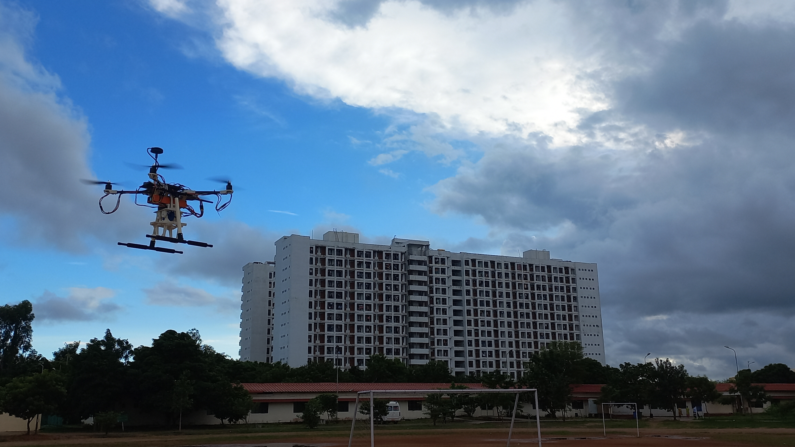
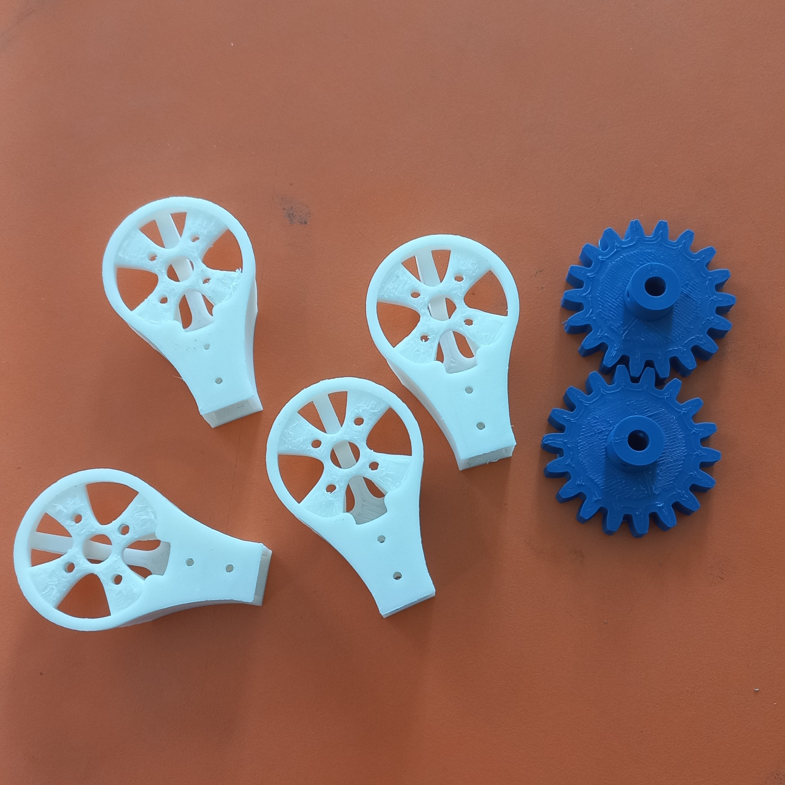

---
tags:
  - Fusion 360
  - SolidWorks
  - CAD Modeling
  - 3D Printing
---
# Design and Fabrication Payload carrying Quadcopter
> :octicons-location-16: Developed at Team Astra, IIITDM Kancheepuram &nbsp;
> :material-calendar: Mar 2023 - Nov 2023 &nbsp;

## Introduction
This work was done as a part of Team Astra, for participation in SAE AeroTHON 2023 competition. I designed and fabricated the drone body based on competition requirements. The drone was made of 3D printed parts and supported by carbon fiber plates.

{ width="300" loading=lazy } { width="450" loading=lazy }

## Fabrication of drone

{ width="300" loading=lazy } { width="300" loading=lazy }

## 3D model of drone

<iframe src="https://iiitdm670.autodesk360.com/shares/public/SH30dd5QT870c25f12fca019d910d82a4efd?mode=embed" width="640" height="480" allowfullscreen="true" webkitallowfullscreen="true" mozallowfullscreen="true"  frameborder="1"></iframe>