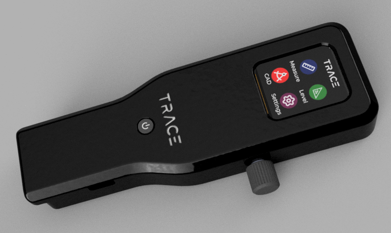
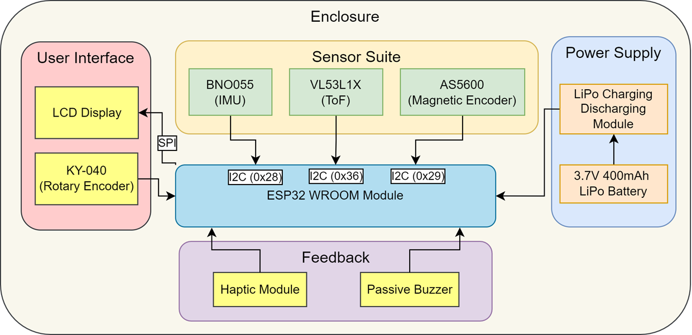
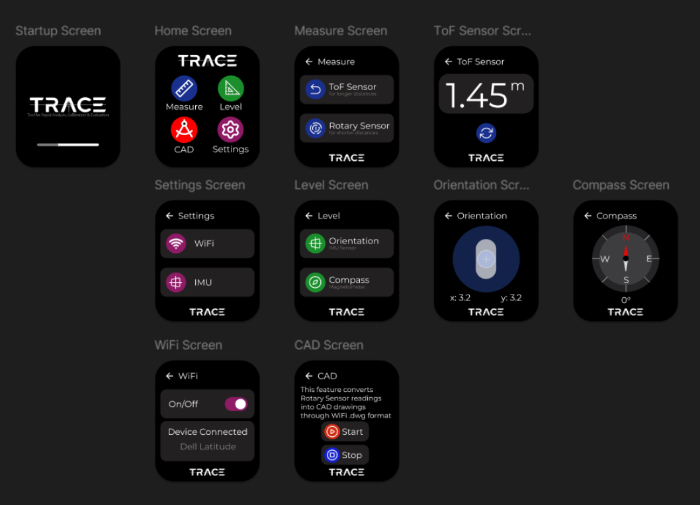
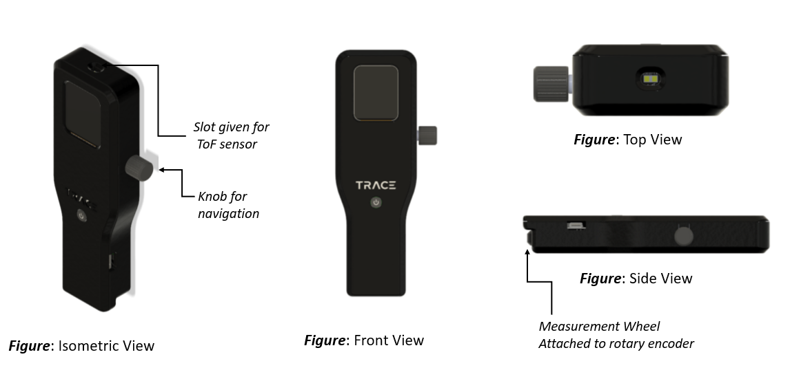
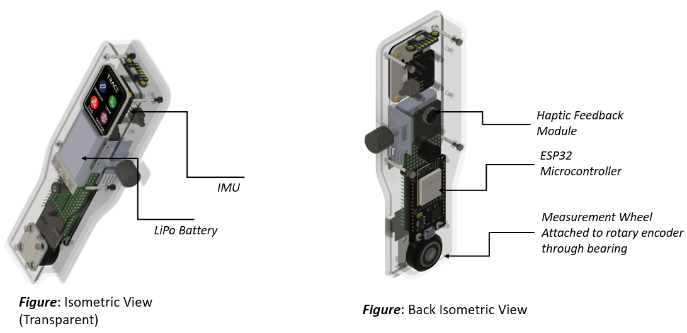
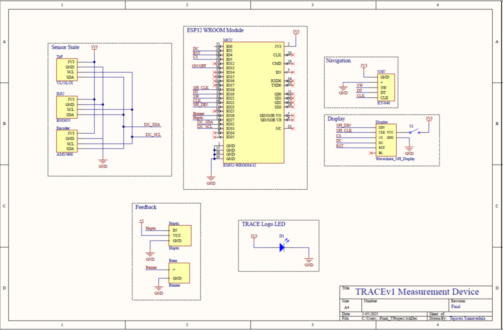
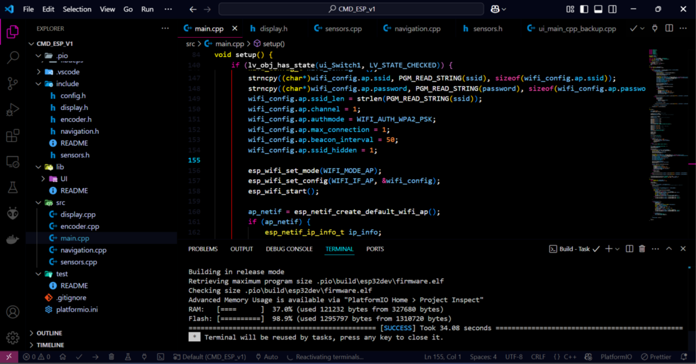

---
tags:
  - C++
  - ESP32
  - Electronics
  - Sensors
  - Soldering
  - LVGL
  - PlatformIO
  - UI Design
  - Figma
  - Fusion 360
  - CAD Modeling
  - 3D Printing
---
# TRACE Device: Tool for Rapid Analysis, Calibration and Evaluation
> :octicons-location-16: Developed at IIITDM Kancheepuram &nbsp;
> :material-calendar: Feb 2025 - May 2025 &nbsp;
> :simple-github: [Github Repository](https://github.com/tejaswisam/trace_device){:target="_blank"}

<figure markdown="span">

{ align=right width="300" loading=lazy}

{ align=right width="300" loading=lazy}

</figure>

## Project Overview

{ align=right width="400" loading=lazy}

This page documents the design, development, and assembly process of the **TRACE Device** (v1), a custom-built, handheld multi-sensor system for capturing orientation, distance, and directional data in real-time. This project blends embedded electronics, interactive UI design, sensor fusion, and custom mechanical housing into a single integrated solution.

## Table of Contents

- [Tech Stack](#tech-stack)
- [System Architecture](#system-architecture)
- [UI and Interaction Design](#ui-and-interaction-design)
- [Hardware Design and CAD](#hardware-design-and-cad)
- [PCB Design and Wiring](#pcb-design-and-wiring)
- [Assembly Process](#assembly-process)
- [Testing and Calibration](#testing-and-calibration)
- [Gallery](#gallery)
- [License](#license)

## Tech Stack

| Layer              | Tools & Technologies Used                |
|--------------------|-------------------------------------------|
| **Firmware**        | Arduino Framework, PlatformIO            |
| **MCU**             | ESP32-WROOM                              |
| **UI Framework**    | [LVGL v9+](https://lvgl.io/){:target="_blank"}              |
| **Sensor Drivers**  | Wire (I2C), Adafruit Sensor Libraries    |
| **Display**         | Waveshare 1.69" LCD (SPI, 240x280)       |
| **IMU**             | BNO055 sensor           |
| **ToF Sensor**      | VL53L1X                        |
| **Rotary Encoder**  | AS5600 Magnetic Encoder, KY-040 Input    |
| **CAD & Enclosure** | Fusion 360, 3D Printed PETG              |
| **Version Control** | Git + GitHub                             |

## System Architecture

The system is modular and divided into the following major components:

- **Sensor Abstraction Layer**: Manages real-time acquisition from ToF, IMU, and encoder
- **UI Layer**: Built with LVGL, it displays menus, sensor readings, and mode transitions
- **Input Controller**: Rotary encoder handler for navigating and selecting UI panels
- **Communication Layer (Planned)**: Future support for Wi-Fi/BLE data export
- **Main Loop**: Initializes subsystems and manages screen switching

<figure markdown="span">

{width="500" loading=lazy}
<figcaption>System Architecture</figcaption>

</figure>

## UI and Interaction Design

The user interface is inspired by modern embedded GUIs with the following principles:

- Minimalist and clutter-free layout
- Animated transitions for screen changes
- Color-coded sensor panels
- Encoder-based selection, mimicking real-world instrumentation interfaces

<figure markdown="span">

{width="500" loading=lazy}
<figcaption>UI design on Figma</figcaption>

</figure>

## Hardware Design and CAD

The enclosure was designed in **Autodesk Fusion 360**, optimized for hand-held ergonomics and internal space efficiency. Key goals:

- Proper spacing for all sensors and wiring
- Accessibility for USB charging
- Ergonomic control layout

<figure markdown="span">
{width="600" loading=lazy}

{width="600" loading=lazy}
</figure>

Design exported and printed with:

- Material: PETG
- Layer height: 0.15 mm
- Infill: 40%

## Circuit Design and Wiring

In early prototypes, sensors are connected via perfboard and jumper wires.

- Bus: I2C for IMU, Encoder, ToF
- SPI for Display
- GPIOs for Encoder Button and Display Backlight

<figure markdown="span">

{width="600" loading=lazy}
<figcaption>Schematic Diagram</figcaption>

</figure>

## Programming and Firmware Development

The firmware is developed using the Arduino framework and structured for clarity and modularity:
```
src/
├── main.cpp            # Main entry point
├── display.cpp         # LVGL UI and rendering logic
├── sensors.cpp         # IMU, ToF, and Encoder data management 
├── navigation.cpp      # Rotary encoder input handling
├── encoder.cpp         # Event callbacks for UI elements
```

- **UI Library**: [LVGL v9+](https://lvgl.io/)
- **Development Environment**: PlatformIO (recommended) or Arduino IDE
- **RTOS Used**: FreeRTOS integration for multi-tasking

[:octicons-arrow-right-24: See More at this Github repo](https://github.com/tejaswisam/trace_device)

<figure markdown="span">

{width="600" loading=lazy}
<figcaption>PlatformIO interface</figcaption>

</figure>

## Gallery

*Add high-quality images, exploded CAD views, PCB layouts, and UI screenshots here.*

## Contact

If you’d like to discuss collaboration or build your own version, feel free to reach out or open an issue on this [`repository`](https://github.com/tejaswisam/trace_device).
